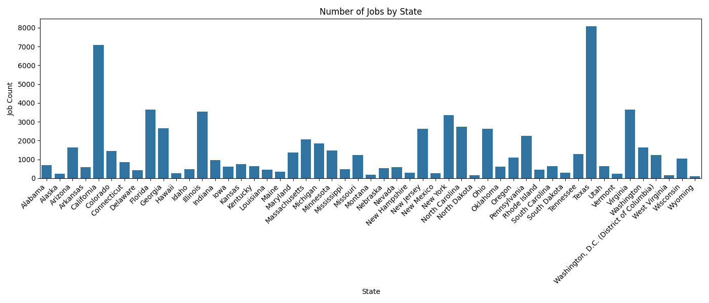
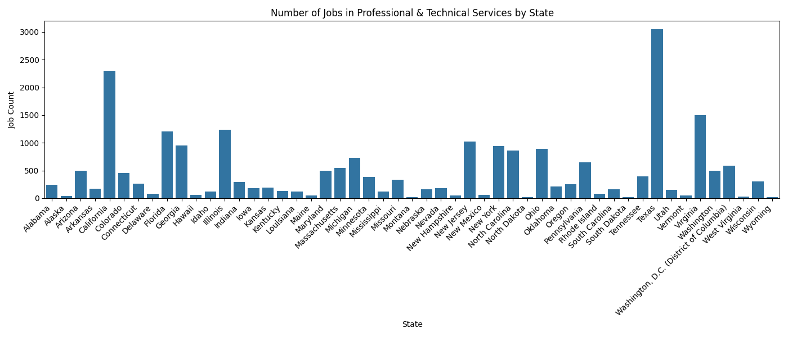
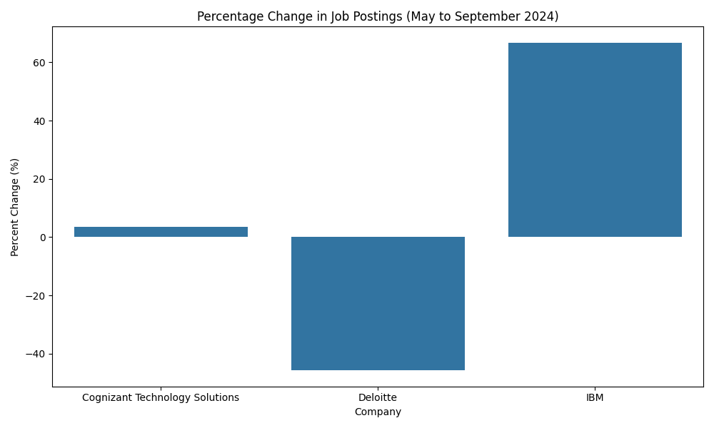
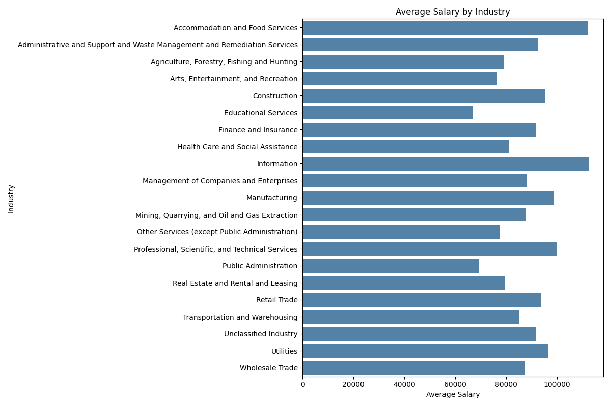
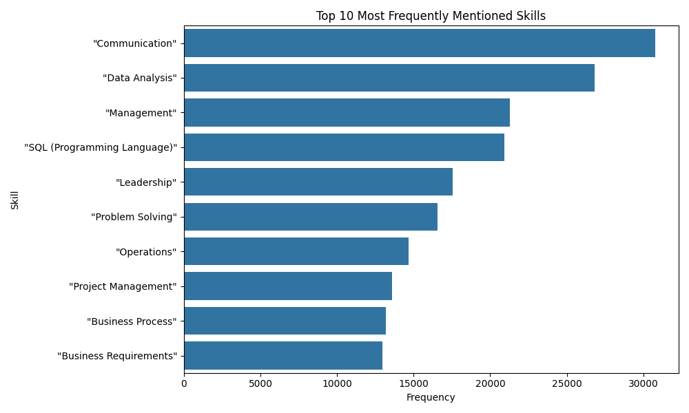

Analysis of the Lightcast job postings dataset using PySpark and Matplotlib.

## Q1: Job Count by State

## Q2: Jobs by Industry

## Q3: Percent Change in Companies

## Q4: Average Salary by Industry

## Q5: Skills Distribution

